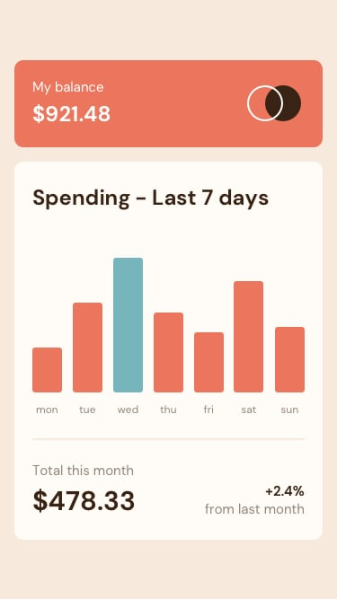

# Frontend Mentor - Expenses chart component solution

This is a solution to the [Expenses chart component challenge on Frontend Mentor](https://www.frontendmentor.io/challenges/expenses-chart-component-e7yJBUdjwt).

## Overview

### The challenge

Users should be able to:

- View the bar chart and hover over the individual bars to see the correct amounts for each day
- See the current day’s bar highlighted in a different colour to the other bars
- View the optimal layout for the content depending on their device’s screen size
- See hover states for all interactive elements on the page
- **Bonus**: Use the JSON data file provided to dynamically size the bars on the chart

### Screenshot



### Links

- Solution URL: [Github](https://github.com/jeremylloyd/expenses-chart-component)
- Live Site URL: [Github Pages](https://jeremylloyd.github.io/expenses-chart-component/)

## My process

### Built with

- HTML
- CSS
- JS
- Apache Echarts

### What I learned

- JS
  - If statement shorthand
    - `condition ? valueIfTrue : valueIfFalse`
    - `window.innerWidth >= 600 ? 15 : 12`
  - `window`
    - `window` is a built-in variable referring to the browser window
    - You can assign a function to `window.onresize` to restyle objects as the user resizes the browser
    - `window.innerWidth` and `window.innerHeight` are useful properties
  - Reading json data with `fetch()`
    - ```let data;
      fetch("./data.json")
        .then((f) => f.json())
        .then((obj) => loadChartData(obj));```
    - The `fetch` function returns a promise, which is asynchronous (as are a lot of functions in JS compared to python). You feed the result to a function which is run when the promise resolves
- Echarts
  - Load it from CDN using `<script src="https://cdn.jsdelivr.net/npm/echarts@5.3.3/dist/echarts.js"></script>`
  - You can't style Echarts with CSS. If you need to make part of the chart responsive, choose HTML/CSS wherever possible (i.e. the "Spending - Last 7 days" title)
  - You can style almost anything by using `myChart.setOption(option);`. Options listed in the [Echarts Documentation](https://echarts.apache.org/en/option.html)
